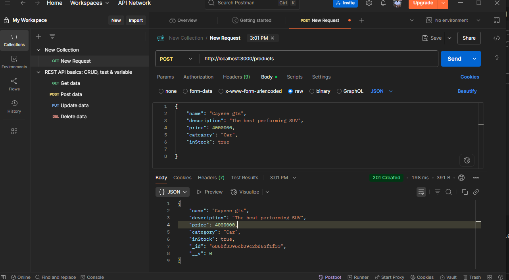

## Week 2 Assignment

##  Overview
This project is a RESTful API built with Express.js to manage a list of products. It supports CRUD operations, filtering, pagination, search, and statistics, along with custom middleware for logging, authentication, validation, and error handling.


##  Project Structure
```
Products.js
server.js
routes 
  └── productRoutes.js
middleware/
    ├── auth.js
    ├── errorHandler.js
    ├── logger.js  
.env.example
README.md
```


##  Setup Instructions

### Prerequisites
- Node.js v18 or higher

### Installation

git clone https://github.com/PLP-MERN-Stack-Development/week-2-express-js-assignment-ThendoNetshandama-1/blob/main/server.js
npm install express
npm install mongoose


### Environment Variables
Create a `.env` file based on `.env.example`:
env
PORT=3000
API_KEY=12345


### Running the Server

node server.js

The server will run on `http://localhost:3000`


##  Using the API in Postman
For every request:
- Add a header: `Authorization: 12345`

---

##  API Endpoints


### Products
- `GET /Products` → List all products
- Optional query parameters:
- `category` - filter by category
- `name` - search by name (partial)
- `page` and `limit` - for pagination

- `GET /Products/:id` → Get product by ID
- `POST /Products` → Create new product
- `PUT /Products/:id` → Update product by ID
- `DELETE /Products/:id` → Delete product by ID

### Stats
- `GET /Products/stats` → Get product count by category

---

##  Example Requests

### Create Product (POST)
```
POST /Products
Body:
{
  "name": "cayene gts",
  "description": "The best performing SUV",
  "price": 4000000,
  "category": "car",
  "inStock": true
}
```

### Filter by Category (GET)
```
GET /Products?category=car
```

### Paginate (GET)
```
GET /Products?page=1&limit=2
```

### Product Stats (GET)
```
GET /Products/stats
```

---

##  Submission Checklist
-  All project files included
-  Middleware: logger, auth, validation, errorHandler
-  API routes implemented
-  `.env.example` provided
-  `README.md` created with instructions & documentation

---


## Sample test


